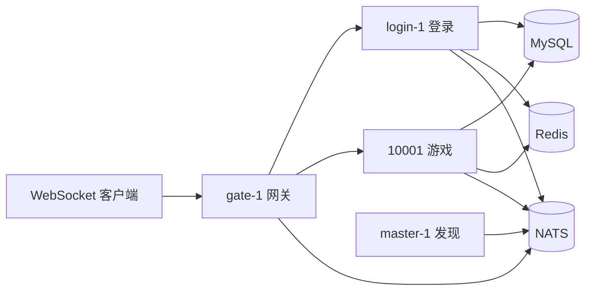

# MMO 后端骨架（Cherry）

基于 [cherry-game/cherry](https://github.com/cherry-game/cherry) 的 Actor + 集群（NATS）最小可运行示例：**Discovery Master → 网关 → 登录服 → 游戏服**，覆盖帐号签发、Token 登录、选角/创角、进场景、移动与聊天广播。

本仓库通过 `go.mod` 的 `replace` 引用同级目录 `cherry-framework` 源码。

## 架构概览



| 节点 | 职责 |
|------|------|
| `master` | NATS 模式集群注册发现（无业务路由） |
| `gateway` | WebSocket + Pomelo 协议、鉴权路由、转发至 login/game |
| `login` | 帐号密码签发 Token、校验、刷新、登出 |
| `game` | 选角/创角/进场、场景内移动（AOI）、同场景聊天 |

## 依赖

- Go 1.24+
- [NATS Server](https://github.com/nats-io/nats-server)（默认 `nats://127.0.0.1:4222`）
- MySQL 8+（库名 `mmo`，DSN 见 `configs/mmo-cluster.json`）
- Redis 7+（默认 `127.0.0.1:6379`）

## 快速启动

### 前置

1. 创建 MySQL 库：`mmo`（表由服务 `AutoMigrate` 自动创建）
2. 启动 Redis
3. 启动 NATS：`nats-server`，或使用脚本通过 Docker 拉起（见下）

### 方式一：脚本（推荐，Windows）

在仓库根目录：

```powershell
# 编译并启动四节点（master → login → game → gateway）
powershell -ExecutionPolicy Bypass -File scripts/start.ps1 -Build

# 停止
powershell -ExecutionPolicy Bypass -File scripts/stop.ps1

# 同时停止 Docker NATS 容器
powershell -ExecutionPolicy Bypass -File scripts/stop.ps1 -StopNats
```

日志目录：`logs/`（`gate.log`、`login.log`、`game.log`、`master.log`，与 profile 中 `ref_logger` 对应）。

网关 WebSocket：`ws://127.0.0.1:10100`

### 方式二：手动 `go run`

在 `mmo-server` 根目录，保证 `configs/mmo-cluster.json` 相对路径可用，**须先 master，再 login/game，最后 gateway**：

```powershell
go run ./cmd/master  -path=configs/mmo-cluster.json -node=master-1
go run ./cmd/login   -path=configs/mmo-cluster.json -node=login-1
go run ./cmd/game    -path=configs/mmo-cluster.json -node=10001
go run ./cmd/gateway -path=configs/mmo-cluster.json -node=gate-1
```

`cluster.discovery.mode` 为 **`nats`**，`cluster.nats.master_node_id` 须与 master 的 `-node` 一致（默认 `master-1`）。

### 联调客户端

```powershell
go run ./cmd/client-demo -ws 127.0.0.1:10100
```

默认执行：issueToken → login → select → enter → bag.add → bag.list → move 冒烟序列。

## 客户端协议（Pomelo + Protobuf）

- 包体：**Protobuf 二进制**（各节点 `SetSerializer(NewProtobuf())`）
- 路由：`nodeType.handlerName.method`
- 与旧 JSON 客户端 **不兼容**

`.proto`：`internal/protocolpb/proto/`（`common`、`auth`、`player`、`scene`、`chat`、`bag`）  
Go 类型入口：`internal/protocol/types.go`（别名至 `internal/protocolpb/gen`）

### 网关鉴权

| 步骤 | Route | 请求 | 响应 |
|------|-------|------|------|
| 签发 Token | `gate.user.issueToken` | `IssueTokenRequest` | `IssueTokenResponse` |
| Token 登录 | `gate.user.login` | `TokenLoginRequest` | `TokenLoginResponse` |
| 刷新 Token | `gate.user.refreshToken` | `RefreshTokenRequest` | `RefreshTokenResponse` |
| 登出 | `gate.user.logout` | `LogoutRequest` | `LogoutResponse` |

说明：

- `issueToken`：`nickname`、`password`、`deviceId` 必填；`clientIp` 由网关注入；失败按「帐号+IP」限流（默认 5 次 / 5 分钟窗口，封禁 10 分钟，见 `redis.login_fail_*`）
- `login`：`accessToken`（或兼容字段 `token`）、`serverId`、`deviceId`
- `refreshToken`：单次使用，刷新后旧 refresh 立即失效；重放返回业务码 `40013`
- 会话策略 `auth.session_policy`：`kick_old`（默认）| `coexist` | `device_limit`（配合 `auth.max_devices_per_uid`）

未绑定 Uid 时仅允许 `issueToken` / `login` / `refreshToken`；其它路由需先登录。

### 游戏玩法

| 步骤 | Route | 请求 | 响应 / Push |
|------|-------|------|-------------|
| 查角 | `game.player.select` | `google.protobuf.Empty` | `PlayerSelectResponse` |
| 创角 | `game.player.create` | `PlayerCreateRequest` | `PlayerCreateResponse` |
| 进场 | `game.player.enter` | `EnterGameRequest` | `EnterGameResponse` |
| 移动 | `game.player.move` | `MoveRequest` | `Empty`；同场景 AOI 内 Push `onMove`（`MoveBroadcast`） |
| 聊天 | `game.chat.send` | `ChatSendRequest` | `Empty`；同场景 Push `onChat`（`ChatBroadcast`） |
| 背包列表 | `game.bag.list` | `google.protobuf.Empty` | `BagListResponse` |
| 背包发放 | `game.bag.add` | `BagAddRequest` | `BagListResponse`（当前背包） |
| 背包扣除 | `game.bag.remove` | `BagRemoveRequest` | `BagListResponse`（当前背包） |

说明：

- 演示为 **每帐号单角色**（`players.uid` 唯一）
- 未完成 `enter` 时，除 `select` / `create` / `enter` 外请求会被网关拒绝
- 移动广播带简单 **AOI 半径过滤**（默认 15，见 `internal/gameapp/world/scene.go`）
- 聊天为同场景全员广播（无 AOI 裁剪）
- 背包须已 `enter`；同 `item_id` 堆叠，单格上限 9999；`add`/`remove` 成功后返回最新 `BagListResponse`

### 业务错误码

定义与注释见 `internal/code/code.go`（`40001`–`40020`，`0` 为成功）。背包相关：`40018` 参数非法、`40019` 数量不足、`40020` 加载失败。网关对登录服 RPC 返回码会做映射透传。

### 重新生成 Protobuf Go 代码

需 [Docker](https://docs.docker.com/get-docker/)：

```powershell
powershell -ExecutionPolicy Bypass -File scripts/genproto.ps1
```

## 数据与持久化

| 存储 | 内容 |
|------|------|
| MySQL `accounts` | 昵称、`bcrypt` 密码哈希 |
| MySQL `players` | 每 Uid 一条角色 |
| MySQL `inventory_items` | 每角色 `player_id + item_id` 堆叠数量 |
| Redis | 帐号昵称缓存、角色/背包 protojson 缓存、access/refresh Token、登录限流、设备会话 |

要点：

- 写路径经 `persistence.WithinTx`：MySQL 事务提交后通过 `AfterCommit` 刷新 Redis，避免脏缓存
- 帐号缓存值格式：`uid|passwordHash`；角色缓存为 **protojson**（与 Pomelo 包体编码独立）
- Token TTL：`redis.access_ttl_seconds`（默认 900）、`redis.refresh_ttl_seconds`（默认 86400）
- 首次 `persistence.Init()` 时 `AutoMigrate` 建表

## 时间（gtime）

业务逻辑请使用 [`internal/gtime`](internal/gtime/)，不要直接 `time.Now()`：

- `gtime.Now()` / `gtime.UnixNow()` — 游戏时间（支持 Cherry 偏移 + Redis `{prefix}:meta:time_bias` 偏置秒）
- `gtime.RealNow()` — 真实系统时间（日志/审计）
- `gtime.ZeroHourUnix`、`IsOverDay`、`DiffDay`、`IsInDayTimeRange` 等 — 日历/刷新点工具（支持自定义日内 `secPnt`）

`persistence.Init()` 启动时会从 Redis 加载时间偏置；GM/测试可通过 `gtime.SaveBiasToRedis` 写入。

## 构建与测试

```powershell
go test ./...

go build -o bin/master.exe  ./cmd/master
go build -o bin/login.exe   ./cmd/login
go build -o bin/game.exe    ./cmd/game
go build -o bin/gateway.exe ./cmd/gateway
```

CI：`.github/workflows/go.yml`（`go test` + 四节点 `go build`）。

## 目录说明

| 路径 | 说明 |
|------|------|
| `cmd/master` | Discovery master |
| `cmd/gateway` | 网关节点 |
| `cmd/login` | 登录节点 |
| `cmd/game` | 游戏节点 |
| `cmd/client-demo` | Protobuf 联调冒烟客户端 |
| `configs/mmo-cluster.json` | 集群、日志、MySQL、Redis、鉴权配置 |
| `scripts/start.ps1` / `stop.ps1` | 四节点启停 |
| `scripts/genproto.ps1` | 生成 `internal/protocolpb/gen` |
| `internal/gatewayapp` | 连接 Agent、鉴权、集群转发 |
| `internal/loginapp` | Token 签发与校验 Actor |
| `internal/gameapp` | 玩家、聊天、背包、场景世界 |
| `internal/persistence` | GORM + Redis + 全局事务与缓存 |
| `internal/code` | 业务错误码 |
| `internal/gtime` | 统一游戏时间与日历工具 |
| `internal/protocolpb` | `.proto` 与生成代码 |
| `cherry-framework` | Cherry 框架源码（`replace`） |

## 配置摘录

`configs/mmo-cluster.json` 常用项：

- `cluster.nats.address` / `master_node_id`
- `node.gate[].address` → `:10100`
- `mysql.dsn`
- `auth.session_policy`、`auth.max_devices_per_uid`
- `redis.*`（TTL、限流、`key_prefix`）

## 后续扩展

可按子系统增量迭代：战斗、背包、匹配、更完整 AOI 等。

若需 **一账号多角**、角色扩展字段或版本化 DB 迁移，应单独评审表结构与 `select/create/enter` 语义后再改。
