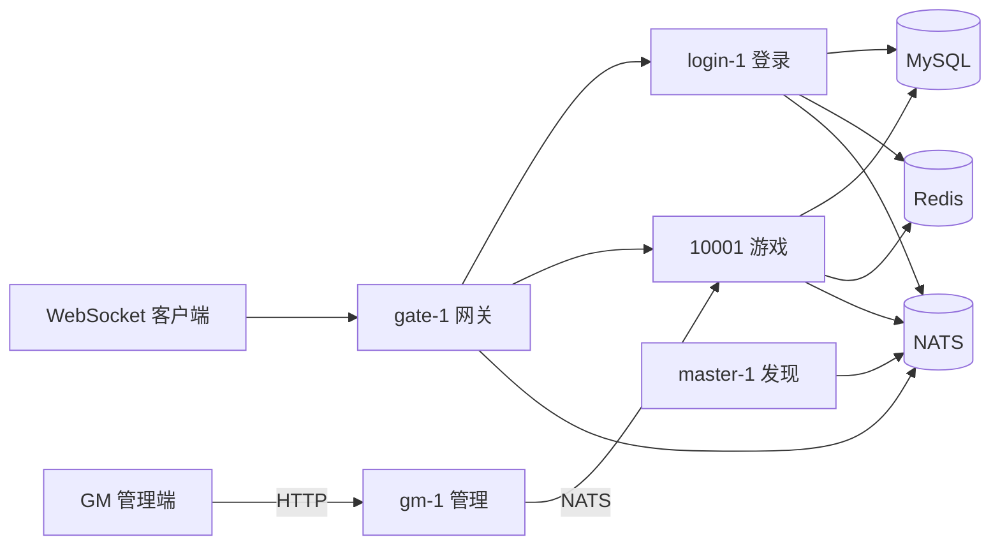

# MMO 后端骨架（Cherry）

基于 [cherry-game/cherry](https://github.com/cherry-game/cherry) 的 Actor + 集群（NATS）示例：**Discovery Master → 网关 → 登录服 → 游戏服 → GM 管理进程**，覆盖帐号签发、Token 登录、选角/创角、进场景、移动/聊天广播、背包系统、策划配表热更。

本仓库通过 `go.mod` 的 `replace` 引用同级目录 `cherry-framework` 源码。

## 架构概览



| 节点 | 进程 | 职责 |
|------|------|------|
| `master` | `cmd/master` | NATS 模式集群注册发现（无业务路由） |
| `gateway` | `cmd/gateway` | WebSocket + Pomelo 协议、鉴权路由、转发至 login/game |
| `login` | `cmd/login` | 帐号密码签发 Token、校验、刷新、登出 |
| `game` | `cmd/game` | 选角/创角/进场、场景移动（AOI）、聊天、背包、GM 指令处理 |
| `gm` | `cmd/gm` | **独立管理进程**：HTTP API，通过 NATS 向 game 节点下发管理指令 |

## 依赖

- Go 1.24+
- [NATS Server](https://github.com/nats-io/nats-server)（默认 `nats://127.0.0.1:4222`）
- MySQL 8+（库名 `mmo`，DSN 见 `configs/mmo-cluster.json`）
- Redis 7+（默认 `127.0.0.1:6379`）

## 快速启动

### 前置

1. 创建 MySQL 库：`mmo`（表由服务 `AutoMigrate` 自动创建）
2. 启动 Redis
3. 启动 NATS：`nats-server`，或使用脚本通过 Docker 拉起（见下）
4. 导入策划配表（可选，game 节点启动时若 `cfg_items` 表为空会跳过配表加载但不影响启动）

```powershell
# 导入演示道具到 MySQL
go run ./gameconfig/cmd/import -profile configs/mmo-cluster.json
```

### 方式一：脚本（推荐，Windows）

在仓库根目录：

```powershell
# 编译并启动五节点（master → login → game → gateway → gm）
powershell -ExecutionPolicy Bypass -File scripts/start.ps1 -Build

# 停止
powershell -ExecutionPolicy Bypass -File scripts/stop.ps1

# 同时停止 Docker NATS 容器
powershell -ExecutionPolicy Bypass -File scripts/stop.ps1 -StopNats
```

日志目录：`logs/`（`master.log`、`gate.log`、`login.log`、`game.log`、`gm.log`，与 profile 中 `ref_logger` 对应）。

- 网关 WebSocket：`ws://127.0.0.1:10100`
- GM HTTP API：`http://127.0.0.1:9080`

### 方式二：手动 `go run`

在 `mmo-server` 根目录，**须先 master，再 login/game，最后 gateway/gm**：

```powershell
go run ./cmd/master  -path=configs/mmo-cluster.json -node=master-1
go run ./cmd/login   -path=configs/mmo-cluster.json -node=login-1
go run ./cmd/game    -path=configs/mmo-cluster.json -node=10001
go run ./cmd/gateway -path=configs/mmo-cluster.json -node=gate-1
go run ./cmd/gm      -http=:9080 -nats=nats://127.0.0.1:4222 -prefix=mmo -game=10001
```

`cluster.discovery.mode` 为 **`nats`**，`cluster.nats.master_node_id` 须与 master 的 `-node` 一致（默认 `master-1`）。

### 联调客户端

```powershell
go run ./cmd/client-demo -ws 127.0.0.1:10100
```

默认执行：issueToken → login → select → enter → bag.add → bag.list → move 冒烟序列。

## GM 管理接口

GM 进程独立运行，通过 HTTP 接收管理请求，经 NATS 转发到 game 节点执行。

### 配置热更

```powershell
# 全量重载所有配表
curl.exe -X POST http://127.0.0.1:9080/gm/config/reload `
  -H "Content-Type: application/json" `
  -d '{"tableName":""}'

# 按表名重载特定表（如 item）
curl.exe -X POST http://127.0.0.1:9080/gm/config/reload `
  -H "Content-Type: application/json" `
  -d '{"tableName":"item"}'
```

响应示例：

```json
{"code":0,"message":"ok","version":"1640000000","tables":1}
```

前提：`configs/mmo-cluster.json` 中 `gameconfig.allow_reload` 设为 `true`。

### 通信链路

```
POST /gm/config/reload  →  gm 进程  →  NATS Request (ClusterPacket)
  →  game 节点 ActorGM  →  actorGMConfig.reloadCluster  →  NATS Response
  →  gm 进程  →  JSON 返回
```

GM 通过 `cherry-{prefix}.remote.game.{gameNodeID}` subject 向 game 节点发送 Cherry `ClusterPacket`，由 game 节点 `ActorGM` 按 `domain`（如 `config`）路由到对应子 Actor 处理。

## 客户端协议（Pomelo + Protobuf）

- 包体：**Protobuf 二进制**（各节点 `SetSerializer(NewProtobuf())`）
- 路由：`nodeType.handlerName.method`
- 与旧 JSON 客户端 **不兼容**

`.proto`：`internal/protocolpb/proto/`（`common`、`auth`、`player`、`scene`、`chat`、`bag`）  
Go 类型入口：`internal/protocol/types.go`（别名至 `internal/protocolpb/gen`）

### 网关鉴权

| 步骤 | Route | 请求 | 响应 |
|------|-------|------|------|
| 签发 Token | `gate.user.issueToken` | `IssueTokenRequest` | `IssueTokenResponse` |
| Token 登录 | `gate.user.login` | `TokenLoginRequest` | `TokenLoginResponse` |
| 刷新 Token | `gate.user.refreshToken` | `RefreshTokenRequest` | `RefreshTokenResponse` |
| 登出 | `gate.user.logout` | `LogoutRequest` | `LogoutResponse` |

说明：

- `issueToken`：`nickname`、`password`、`deviceId` 必填；`clientIp` 由网关注入；失败按「帐号+IP」限流（默认 5 次 / 5 分钟窗口，封禁 10 分钟，见 `redis.login_fail_*`）
- `login`：`accessToken`（或兼容字段 `token`）、`serverId`、`deviceId`
- `refreshToken`：单次使用，刷新后旧 refresh 立即失效；重放返回业务码 `40013`
- 会话策略 `auth.session_policy`：`kick_old`（默认）| `coexist` | `device_limit`（配合 `auth.max_devices_per_uid`）

未绑定 Uid 时仅允许 `issueToken` / `login` / `refreshToken`；其它路由需先登录。

### 游戏玩法

| 步骤 | Route | 请求 | 响应 / Push |
|------|-------|------|-------------|
| 查角 | `game.player.select` | `google.protobuf.Empty` | `PlayerSelectResponse` |
| 创角 | `game.player.create` | `PlayerCreateRequest` | `PlayerCreateResponse` |
| 进场 | `game.player.enter` | `EnterGameRequest` | `EnterGameResponse` |
| 移动 | `game.player.move` | `MoveRequest` | `Empty`；同场景 AOI 内 Push `onMove`（`MoveBroadcast`） |
| 聊天 | `game.chat.send` | `ChatSendRequest` | `Empty`；同场景 Push `onChat`（`ChatBroadcast`） |
| 背包列表 | `game.bag.list` | `google.protobuf.Empty` | `BagListResponse`（`BagItem` 含 `slot`） |
| 背包发放 | `game.bag.add` | `BagAddRequest` | `BagListResponse` + Push `onBagChange` |
| 背包扣除 | `game.bag.remove` | `BagRemoveRequest` | `BagListResponse` + Push `onBagChange` |
| 背包移动 | `game.bag.move` | `BagMoveRequest`（`fromSlot` / `toSlot`） | `BagListResponse` + Push `onBagChange` |
| 背包拆分 | `game.bag.split` | `BagSplitRequest`（`fromSlot` / `count`） | `BagListResponse` + Push `onBagChange` |
| 配置热更 | `game.gm.config.reload` | `RefreshTokenRequest`（`refreshToken` 承载表名） | `RefreshTokenResponse` |

说明：

- 演示为 **每帐号单角色**（`players.uid` 唯一）
- 未完成 `enter` 时，除 `select` / `create` / `enter` 外请求会被网关拒绝
- 移动广播带简单 **AOI 半径过滤**（默认 15，见 `internal/gameapp/world/scene.go`）
- 聊天为同场景全员广播（无 AOI 裁剪）
- 背包须已 `enter`；**32 固定槽位**（`slot` 0–31）；同 `item_id` 优先堆叠，单格上限由配表 `max_stack` 控制，满则占空槽
- `remove`：`bySlot=true` 按槽扣减；否则按 `itemId` 从多槽合计扣减
- `add` / `remove` / `move` / `split` 成功后 RPC 返回最新背包，并 Push `onBagChange`（同 `BagListResponse`）
- `game.gm.config.reload` 可通过 Pomelo 客户端直接调用，也可通过 GM HTTP API 间接触发

### 业务错误码

定义与注释见 `internal/code/code.go`（`40001`–`40025`，`0` 为成功）：

| 码 | 常量 | 说明 |
|----|------|------|
| 0 | `OK` | 成功 |
| 40001 | `LoginFail` | 登录/鉴权通用失败 |
| 40002 | `NotLoggedIn` | 未登录 |
| 40003 | `EnterSceneFail` | 进场/移动无效 |
| 40004 | `InvalidServer` | 区服 ID 无效 |
| 40005 | `LoginRPCFail` | 网关调用登录服失败 |
| 40006 | `PlayerDenyLogin` | 未登录踢下线 |
| 40007 | `PlayerCreateFail` | 创角失败 |
| 40008 | `PlayerNotFound` | 角色不存在 |
| 40009 | `PlayerNotEntered` | 未进场 |
| 40010 | `InvalidPassword` | 密码错误 |
| 40011 | `AccessTokenInvalid` | 访问令牌无效 |
| 40012 | `RefreshTokenInvalid` | 刷新令牌无效 |
| 40013 | `RefreshTokenReplay` | 刷新令牌重放 |
| 40014 | `LoginRateLimited` | 登录限流 |
| 40015 | `DeviceIDRequired` | 缺少设备 ID |
| 40016 | `DeviceLimitReached` | 设备数达上限 |
| 40017 | `DeviceMismatch` | 设备 ID 不一致 |
| 40018 | `BagItemInvalid` | 物品 ID/数量非法 |
| 40019 | `BagItemNotEnough` | 物品数量不足 |
| 40020 | `BagLoadFail` | 背包加载失败 |
| 40021 | `BagSlotInvalid` | 槽位非法 |
| 40022 | `BagFull` | 背包已满 |
| 40023 | `ItemNotFound` | 道具不在配表 |
| 40024 | `ConfigReloadDenied` | 未开启配表 reload |
| 40025 | `ConfigReloadFail` | 配表 reload 失败 |

### 重新生成 Protobuf Go 代码

需 [Docker](https://docs.docker.com/get-docker/)：

```powershell
powershell -ExecutionPolicy Bypass -File scripts/genproto.ps1
```

## 策划配表（gameconfig）

Excel/CSV 策划数据经 [Luban](https://github.com/focus-creative-games/luban) 导出 JSON 与 Go 结构体，import 工具写入 MySQL，game 节点启动时 Load 到内存，支持运行时热更。

### 目录结构

| 路径 | 说明 |
|------|------|
| `gameconfig/datas/` | 策划 Excel/CSV 源表 |
| `gameconfig/defines/` | Luban schema（`__root__.xml`） |
| `gameconfig/tools/gen.ps1` | 一键导表脚本 |
| `gameconfig/tools/luban/` | Luban.ClientServer |
| `gameconfig/gen/cfg/` | 生成的 Go 类型（表结构体 + tables 访问器） |
| `gameconfig/gen/data/` | 生成的 JSON（import 输入） |
| `gameconfig/cmd/import/` | JSON → MySQL 导入工具 |
| `gameconfig/pkg/schema/` | GORM 配置表模型（`CfgVersion`、`CfgItem`） |
| `gameconfig/pkg/runtime/` | 运行时 Load / Reload / 查询 / 内存快照 |

### 工作流

```powershell
# 1. 导表（需 .NET 6+ 与 Luban，见 gameconfig/tools/luban/README.md）
.\gameconfig\tools\gen.ps1

# 2. 导入 MySQL
go run ./gameconfig/cmd/import -profile configs/mmo-cluster.json

# 3. 启动 game 节点（启动时自动 Load）
go run ./cmd/game -profile configs/mmo-cluster.json -node 10001
```

### 演示道具

| id | name | max_stack |
|----|------|-----------|
| 1001 | 小型生命药水 | 99 |
| 1002 | 铜币袋 | 9999 |
| 2001 | 新手木剑 | 1 |
| 3001 | 任务信件 | 1 |

### 热更

profile 中 `gameconfig.allow_reload` 设为 `true` 后：

- 通过 GM HTTP API：`POST /gm/config/reload`
- 通过 Pomelo RPC：`game.gm.config.reload`

详见 [gameconfig/README.md](gameconfig/README.md)。

## 数据与持久化

| 存储 | 内容 |
|------|------|
| MySQL `accounts` | 昵称、`bcrypt` 密码哈希 |
| MySQL `players` | 每 Uid 一条角色 |
| MySQL `inventory_items` | 每角色 `player_id + item_id` 堆叠数量 |
| MySQL `cfg_items`、`cfg_versions` | 策划配置表（gameconfig） |
| Redis | 帐号昵称缓存、角色/背包 protojson 缓存、access/refresh Token、登录限流、设备会话、时间偏置 |

要点：

- 写路径经 `persistence.WithinTx`：MySQL 事务提交后通过 `AfterCommit` 刷新 Redis，避免脏缓存
- 帐号缓存值格式：`uid|passwordHash`；角色缓存为 **protojson**（与 Pomelo 包体编码独立）
- Token TTL：`redis.access_ttl_seconds`（默认 900）、`redis.refresh_ttl_seconds`（默认 86400）
- 首次 `persistence.Init()` 时 `AutoMigrate` 建表（含 gameconfig 配置表）

## 时间（gtime）

业务逻辑请使用 [`internal/gtime`](internal/gtime/)，不要直接 `time.Now()`：

- `gtime.Now()` / `gtime.UnixNow()` — 游戏时间（支持 Cherry 偏移 + Redis `{prefix}:meta:time_bias` 偏置秒）
- `gtime.RealNow()` — 真实系统时间（日志/审计）
- `gtime.ZeroHourUnix`、`IsOverDay`、`DiffDay`、`IsInDayTimeRange` 等 — 日历/刷新点工具

`persistence.Init()` 启动时会从 Redis 加载时间偏置；GM/测试可通过 `gtime.SaveBiasToRedis` 写入。

## 构建与测试

```powershell
# 全量测试
go test ./...

# 编译各节点
go build -o bin/master.exe  ./cmd/master
go build -o bin/login.exe   ./cmd/login
go build -o bin/game.exe    ./cmd/game
go build -o bin/gateway.exe ./cmd/gateway
go build -o bin/gm.exe      ./cmd/gm

# 编译配表导入工具
go build -o bin/import-config.exe ./gameconfig/cmd/import
```

CI：`.github/workflows/go.yml`（`go test` + 五节点 `go build`）。

## 目录说明

| 路径 | 说明 |
|------|------|
| `cmd/master` | Discovery master |
| `cmd/gateway` | 网关节点 |
| `cmd/login` | 登录节点 |
| `cmd/game` | 游戏节点 |
| `cmd/gm` | **GM 管理进程（HTTP + NATS）** |
| `cmd/client-demo` | Protobuf 联调冒烟客户端 |
| `configs/mmo-cluster.json` | 集群、日志、MySQL、Redis、鉴权、gameconfig 配置 |
| `scripts/start.ps1` / `stop.ps1` | 五节点启停 |
| `scripts/genproto.ps1` | 生成 `internal/protocolpb/gen` |
| `internal/masterapp` | Master 节点（集群发现） |
| `internal/gatewayapp` | 网关：连接 Agent、鉴权、集群转发 |
| `internal/loginapp` | 登录：Token 签发与校验 Actor |
| `internal/gameapp` | 游戏：玩家、聊天、背包、场景世界、GM Actor |
| `internal/gmapp` | **GM 进程：HTTP 路由 + NATS 通信** |
| `internal/persistence` | GORM + Redis + 全局事务与缓存 |
| `internal/protocol` | 协议类型别名 |
| `internal/protocolpb` | `.proto` 与生成的 Go 代码 |
| `internal/code` | 业务错误码 |
| `internal/gtime` | 统一游戏时间与日历工具 |
| `gameconfig/` | 策划配表：Excel/CSV → Luban → JSON → MySQL → runtime |
| `cherry-framework` | Cherry 框架源码（`go.mod replace`） |
| `docs/plans/` | 功能计划与进度（策划文档 + 实施计划） |

## 配置摘录

`configs/mmo-cluster.json` 常用项：

- `cluster.nats.address` / `master_node_id`
- `node.gate[].address` → `:10100`
- `mysql.dsn`
- `auth.session_policy`（`kick_old` / `coexist` / `device_limit`）、`auth.max_devices_per_uid`
- `redis.*`（TTL、限流、`key_prefix`）
- `gameconfig.allow_reload`（是否允许热更）、`gameconfig.import_data_dir`

## 功能计划与进度

后续迭代在 [`docs/plans/README.md`](docs/plans/README.md) 维护：每项功能对应 plan 文件与 `done` / `in_progress` / `planned` 状态。新功能开工前先更新计划再实现。

## 后续扩展

Backlog 见 `docs/plans/`（战斗骨架、一账号多角、DB 版本化迁移等）。若需新功能，须先生成策划 `*-design.md`，评审通过后再建实施 plan 并写代码。