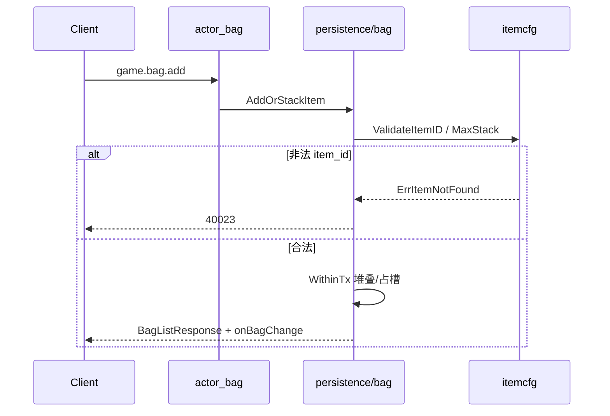

# 道具系统 策划文档

> **Status:** draft  
> **说明：** 待评审；确认后改为 `approved` 再创建实施计划与写代码。  
> **依赖（已实现）：** [背包系统策划](2026-05-28-bag-system-design.md)  
> **实施计划：** （策划通过后创建）[`2026-05-28-item-system.md`](2026-05-28-item-system.md)

**概念划分：**

- **道具系统（本策划）：** 物品**类型**静态元数据（`item_id` 是什么、能否堆叠、堆叠上限等）。
- **背包系统：** 玩家**实例**（哪个 `player_id`、哪个 `slot`、持有多少 `count`）。

---

## 背景与目标

当前背包 [`bag.add`](../../internal/persistence/bag.go) 仅校验 `item_id >= 1`，任意正整数可入库；单槽堆叠上限全局写死 `MaxBagStack = 9999`，与物品种类无关。这会导致：

- GM/脚本误填 ID 无法拦截；
- 未来「不可堆叠装备」「上限 99 的消耗品」无法表达；
- 客户端无法从服务端获得名称、类型等展示信息。

**一期目标：** 引入只读**道具配置**，在背包变更路径上校验 `item_id` 存在，并按配置 `max_stack` 约束 add / 堆叠 / move 合并。

**二期目标：** 协议层向客户端暴露元数据（或独立查询接口），扩展物品类型、绑定、丢弃等规则。

---

## 用户场景

1. **GM / 测试发奖：** 调用 `game.bag.add`，仅当 `itemId` 在配置表中存在且 `count` 合法时入库；非法 ID 返回明确错误码。
2. **玩家整理背包：** `move` 合并两栈同 `item_id` 时，合并后数量不超过该物品的 `max_stack`；`split` 行为不变，仍受单槽上限约束。
3. **（二期）客户端展示：** 打开背包时除 `slot/itemId/count` 外，可显示名称、类型图标等（见「协议设计 · 二期」）。

---

## 功能范围

### 一期（与背包集成）

- 静态道具配置加载（方案见下，**实施前确认**）
- 包 `internal/itemcfg`：`Load`、`Get`、`Exists`、`MaxStack(itemId)` 等
- game 节点启动时加载配置（与 `gameapp.Run` 同进程）
- 接入 [`internal/persistence/bag.go`](../../internal/persistence/bag.go)：`add` / `remove` / `move` / `split` 路径校验 `item_id`
- 有效堆叠上限：`effectiveMaxStack(id) = min(全局 MaxBagStack, itemcfg.MaxStack(id))`
- 演示配置表：至少包含 `client-demo` 使用的 `1001`
- 单元测试：`itemcfg` + `bag_test` 扩展非法 ID、按物品上限场景
- 新增业务错误码 `40023 ItemNotFound`（与 `40018` 参数非法区分）

### 一期不包含

- MySQL 道具配置表、运营后台热更
- 掉落、任务奖励、邮件附件发放（仅预留接口语义）
- 装备栏、仓库、交易、绑定实例 UUID
- 修改 `bag.proto` 消息结构

### 二期（单独立项）

- 协议 enrichment：`BagItem` 增加字段，或 `game.item.get` / `game.item.list`
- 物品类型驱动逻辑：消耗品使用、装备穿戴、丢弃/销毁校验
- `discardable` / `bind_type` 等行为字段落地
- 配置热更、多环境路径策略

---

## 道具元数据模型

建议配置结构（JSON / Go 表同构）：

| 字段 | 类型 | 必填 | 说明 |
|------|------|------|------|
| `id` | int32 | 是 | 全局唯一 `item_id`，与背包 `item_id` 一致 |
| `name` | string | 是 | 显示名（一期仅配置内，二期下发客户端） |
| `type` | enum/string | 是 | 如 `consumable` / `material` / `equipment`（一期仅存储，逻辑二期用） |
| `max_stack` | int32 | 是 | 单槽最大堆叠，1 表示不可与其它槽合并为新堆（仍占 1 格） |
| `stackable` | bool | 是 | `false` 时强制 `max_stack = 1` |
| `discardable` | bool | 否 | 是否允许玩家丢弃（一期不校验 remove，二期用） |
| `bind_type` | enum | 否 | 如 `none` / `pickup` / `account`（一期不实现） |

**全局常量（代码，非配置）：**

- `MaxBagStackGlobal = 9999`：硬顶，任何物品 `max_stack` 不得超过此值
- `MaxBagSlots = 32`：仍由背包系统定义

### 演示道具表（建议写入配置）

| id | name | type | max_stack | stackable | 说明 |
|----|------|------|-----------|-----------|------|
| 1001 | 小型生命药水 | consumable | 99 | true | 对齐 `cmd/client-demo` |
| 1002 | 铜币袋 | material | 9999 | true | 材料高堆叠 |
| 2001 | 新手木剑 | equipment | 1 | false | 不可堆叠装备示例 |
| 3001 | 任务信件 | quest | 1 | false | 任务道具示例 |

---

## 配置方案对比（实施前确认）

| 方案 | 做法 | 优点 | 缺点 | 一期建议 |
|------|------|------|------|----------|
| **A. JSON 文件** | `configs/items.json`，game 启动 `itemcfg.Load(path)` | 与 [`configs/mmo-cluster.json`](../../configs/mmo-cluster.json) 风格一致；策划/运营可 diff；易扩展条数 | 需校验 JSON 格式与重复 id；错误配置需启动失败或打日志 | **默认倾向** |
| **B. Go 嵌入表** | `internal/itemcfg/items.go` 变量 map | 编译期类型安全；无 IO；单测简单 | 改配置需重新编译；不适合大量条目 | 演示服、条目极少时可用 |
| **C. MySQL 配置表** | `item_defs` 表 + 缓存 | 运营可在线改；多环境共享 | 引入迁移、缓存刷新、与玩法配置流程重；一期过重 | 不建议一期 |

**推荐决策流程：** 一期采用 **方案 A**；若条目 &lt; 10 且长期不改，可退化为 **方案 B**。实施 plan 中记录最终选型。

**加载时机：** `gameapp.Run` 在 `app.Startup()` 之前调用 `itemcfg.MustLoad(...)`，失败则 panic 或拒绝启动（可配置为 warn-only，一期建议 **失败即启动失败**）。

**路径：** 可通过 profile 增加 `item_config_path`，默认 `configs/items.json`（相对进程工作目录或 profile 目录，实施时二选一并写 README）。

---

## 模块划分

```
internal/itemcfg/
  config.go      # ItemDef 结构体
  load.go        # Load / MustLoad
  query.go       # Get / Exists / MaxStack / ValidateItemID
  load_test.go
```

**对外 API（一期）：**

```go
func Load(path string) error
func MustLoad(path string)
func Exists(itemID int32) bool
func Get(itemID int32) (ItemDef, bool)
func MaxStack(itemID int32) int32  // 不存在返回 0
func ValidateItemID(itemID int32) error // ErrItemNotFound
```

**错误：** 包内 `var ErrItemNotFound`；Actor 层映射为 `code.ItemNotFound`（40023）。

---

## 与背包集成（一期）



| 接入点 | 变更 |
|--------|------|
| `validateBagItem` 或调用前 | `item_id` 须 `itemcfg.Exists`；`count` 不超过 `itemcfg.MaxStack(item_id)` |
| `addOrStackItemInTx` | 堆叠 room 使用 `effectiveMaxStack(item_id)` 替代常量 `MaxBagStack` |
| `moveItemInTx` 同 ID 合并 | 合并后 `to.count + move <= effectiveMaxStack(item_id)` |
| `remove` / `split` | 仅校验涉及行的 `item_id` 仍存在于配置（防止历史脏数据；可选一期只做 add/move） |
| `actor_bag.respondBagError` | 增加 `ErrItemNotFound` → `40023` |

**不变：** 槽位数 32、`move` 异物品交换、`split` 规则、Redis 缓存策略均由背包策划定义，本系统不修改表结构。

---

## 协议设计

### 一期

- **不修改** [`bag.proto`](../../internal/protocolpb/proto/bag.proto)。
- `BagListResponse` 仍为 `slot` / `itemId` / `count`。
- 行为变化：非法 `itemId` 的 `add` 失败；合法物品的堆叠上限可能小于 9999（客户端应能展示 count，无需感知 name）。

### 二期草案（对比，不实施）

| 方案 | 描述 | 优点 | 缺点 |
|------|------|------|------|
| **2a. 扩展 BagItem** | `BagItem` 增加 `name`、`item_type`、`max_stack` | 一次 list 拿全 | 背包 Payload 变大；配置变更需重登刷新 |
| **2b. game.item.get** | `ItemGetRequest{item_id}` → `ItemDefView` | 按需拉取 | 客户端多次请求 |
| **2c. game.item.list** | 下发全表或分页 | 适合图鉴 | 表大时流量高 |

**倾向：** 演示服可选 **2a**；正式项目大规模物品用 **2b + 本地缓存**。

---

## 错误码

| 码 | 常量（建议） | 含义 | 与现有关系 |
|----|--------------|------|------------|
| 40018 | `BagItemInvalid` | `count` 非法、move 合并失败等 | 保留 |
| 40023 | `ItemNotFound` | `item_id` 不在配置表 | **新增** |

**不推荐**复用 40018 表示「物品不存在」，避免客户端无法区分「数量错了」与「ID 不存在」。

---

## 数据与持久化

- **一期无新表**；`inventory_items` 结构不变。
- 配置进程内只读；重启 game 节点即生效（JSON 方案）。
- 若线上已有非法 `item_id` 脏行：一期可不自动清理；`list` 仍返回，但 `add` 同类 ID 时按新规则。可选迁移脚本二期再议。

---

## 业务规则

1. **存在性：** `item_id < 1` 或配置不存在 → `ItemNotFound`（40023）。
2. **堆叠上限：** `effectiveMaxStack(id) = min(9999, cfg.max_stack)`；`stackable=false` 时配置 `max_stack` 必须为 1。
3. **add：** 先向同 `item_id` 槽堆叠，再占空槽；每槽 `count <= effectiveMaxStack`。
4. **move 合并：** 仅同 `item_id`；合并后目标槽 `count <= effectiveMaxStack`。
5. **remove：** 一期可不校验配置（玩家应能丢掉已下线物品）；二期可按 `discardable` 限制。
6. **split / 异物品 swap：** 逻辑同背包策划，仅受各自 `item_id` 的 `max_stack` 约束。

---

## 验收标准

- [ ] `configs/items.json`（或选定方案）含演示表 4 条，启动加载成功
- [ ] `itemcfg` 单测：Exists、MaxStack、重复 id 加载失败
- [ ] `bag.add` 非法 `item_id` 返回 40023
- [ ] `bag.add` 超过该物品 `max_stack` 返回 40018
- [ ] `move` 合并后不超过物品 `max_stack`
- [ ] `go test ./internal/itemcfg/... ./internal/persistence/...` 通过
- [ ] README 补充道具配置说明与错误码 40023
- [ ] `client-demo` 仅使用配置内 ID（如 1001）

---

## 风险与依赖

| 项 | 说明 |
|----|------|
| 依赖 | [背包系统 v2](2026-05-28-bag-system-design.md) 已 `approved` 并实现 |
| 配置选型 | JSON / Go 表实施前与你确认（见「配置方案对比」） |
| 战斗/掉落 | [backlog-combat.md](backlog-combat.md) 未做；发奖仍走 `bag.add` |
| 热更 | 一期不支持；改 JSON 需重启 game |
| 兼容 | 一期客户端协议不变；仅错误码与堆叠行为可能更严 |

---

## 实施索引

**当前阶段：策划评审（draft）**

策划 **approved** 且你确认后：

1. 新建 [2026-05-28-item-system.md](2026-05-28-item-system.md)（实施计划）
2. `docs/plans/README.md` → `in_progress`
3. 实现 `internal/itemcfg` + 接入 `bag.go` + `40023` + 测试 + README
4. 二期另建 `*-item-system-v2-design.md` 或在本策划「二期」章节立项

**不在本策划实施：** 装备系统、掉落表、MySQL 配置后台。
