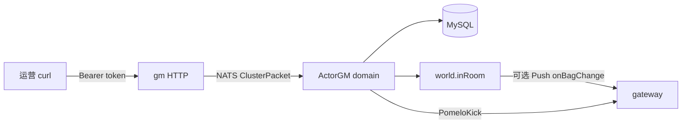

# GM 运营后台 P0 策划文档

> **Status:** approved  
> **实施计划：** [`2026-09-14-gm-ops-p0.md`](2026-09-14-gm-ops-p0.md)  
> **后续：** [`backlog-gm-ops.md`](backlog-gm-ops.md)

**For agentic workers:** 填完整文各章节；`Status: approved` 前不得创建实施计划、不得改业务代码。无把握处写「待定」并列入风险。

---

## 背景与目标

当前 GM 独立进程只有 `GET /gm/health` 与 `POST /gm/config/reload`。发道具只能走玩家 Session 上的 `game.bag.add`，无法按 `player_id` 运营发放；查号、看背包、踢人同样没有运营入口。HTTP 无鉴权，热更还借用 `RefreshTokenRequest` 传表名。

**一期目标：** 在现有「HTTP → NATS ClusterPacket → `ActorGM` 子域」链路上，补齐最小可用运营面：共享 token 鉴权、独立 `gm.proto`、按账号/角色/背包查询、按 `player_id` 发道具（在线 Push）、按 uid 踢下线；写操作落审计表。验收用 curl / JSON，不做 Web UI。

---

## 用户场景

1. **查人：** 运营用 nickname 或 uid 查账号，用 `player_id` / 角色名 / uid 查角色，再按 `playerId + bagType` 看背包。
2. **发奖：** 对任意已有角色 `POST /gm/bag/grant`；离线只写库+刷缓存，在线额外 Push `onBagChange`。不要求玩家当前在线或已 `enter`。
3. **踢人 / 热更：** `POST /gm/player/kick` 断开该 uid 在网关上的连接（不封号、不吊销 token）；配表热更沿用现接口，但必须带 token，且改走 `GmReloadRequest`。

---

## 功能范围

### 包含

- **A1 鉴权：** GM HTTP 共享 secret（`-token` / `GM_HTTP_TOKEN`）。`/gm/health` 免鉴权；其余接口校验 `Authorization: Bearer` 或 `X-GM-Token`。token 为空则除 health 外一律拒绝（失败关闭）。
- **A2 审计：** MySQL `gm_ops_logs`，由 **game 节点** 在 grant / kick / reload 执行后写入；查询接口不写审计。插入失败只打日志，不回滚业务。
- **A3 协议：** 新增 `internal/protocolpb/proto/gm.proto`，停止借用 auth proto 传 GM 参数。reload 的 HTTP JSON `{tableName}` 保持兼容，内部改映射到 `GmReloadRequest`。
- **A4 路由：** `ActorGM.OnFindChild` 增加 `account` / `player` / `bag`；`config` 保留。GM 进程按 domain 拼 `TargetPath`（`{game}.gm.{domain}`）+ `FuncName`。
- **A5 目标解析：** persistence 新增按 `player_id`（不校验归属 uid）、按角色名、按 uid 列角色、按 uid/nickname 查账号；grant 后用 `uid` 查场景在线并 Push。
- **B1 / B2 / B3：** 查账号、查角色（含软删标记）、查指定背包。
- **C1：** 按 `playerId` 发放；`bagType` 缺省按 `item.bag_type` 自动路由；显式指定仍校验 `40028`。
- **D1：** 按 `uid` 或 `playerId` 踢下线；离线视为成功且 `kicked=false`。
- **E3：** 现有 reload 挂上鉴权与新 proto。
- 更新 `scripts/start.ps1`、`docker-compose.yml`、`scripts/docker-smoke.ps1`、根 `README.md` 的 GM 说明与默认 token。

### 不包含

- Web 控制台、TLS、多 GM 账号权限树 / SSO
- 扣道具、清背包、改槽（C2/C3）
- 封号/解封、禁言、改名、软删恢复、重置密码（D2–D6）
- 在线列表、查设备会话（B4/B6）
- 公告、调游戏时间、维护模式（E1/E2/E4）
- 邮件、货币账本、礼包码、活动开关
- 多 game 节点广播（仍单 `-game`）
- 踢人时吊销 token / 禁止重登
- 对客户端暴露 Pomelo 路由 `game.gm.*`（Cherry 仅 3 段路由，与 uid 子 Actor 冲突；P0 只走 HTTP→NATS Remote）

P1/P2 见 [`backlog-gm-ops.md`](backlog-gm-ops.md)。

---

## 协议设计

### HTTP（gm 进程，JSON）

除 health 外均需 token。写操作可带 `X-GM-Operator`（缺省 `anonymous`），原样传入 Cluster 请求供审计。

| 方法 | 路径 | 请求 | 响应 | 说明 |
|------|------|------|------|------|
| GET | `/gm/health` | — | 现有 `healthRsp` | 免鉴权 |
| GET | `/gm/account` | query：`uid` **或** `nickname` 二选一 | `GmAccountView` | B1 |
| GET | `/gm/player` | query：`playerId` **或** `name` **或** `uid` 三选一 | `GmPlayerQueryResponse` | B2；`uid` 返回该账号角色列表 |
| GET | `/gm/bag` | query：`playerId` + `bagType`（均必填） | `BagListResponse` | B3；角色不存在 `40031` |
| POST | `/gm/bag/grant` | `{"playerId","itemId","count","bagType"}` | `GmGrantResponse` | C1；`count` 缺省 1；`bagType` 缺省 0=自动路由 |
| POST | `/gm/player/kick` | `{"uid"}` 或 `{"playerId"}` 二选一 | `GmKickResponse` | D1 |
| POST | `/gm/config/reload` | `{"tableName":""}` | 现有 `{code,message,version,tables}` | E3；内部改 `GmReloadRequest` |

统一业务失败：HTTP 仍 200，JSON `code` 为业务码（与现 reload 失败一致）。鉴权失败：HTTP **401**，`code=40029`。参数非法：HTTP 400，`code=40030`。

### NATS / ClusterPacket

```
POST/GET /gm/... 
  → gm 进程鉴权
  → ClusterPacket{ TargetPath: "{gameNodeID}.gm.{domain}", FuncName, ArgBytes }
  → subject cherry-{prefix}.remote.game.{gameNodeID}
  → ActorGM 子 Actor Remote 方法
  → Response{code, data}
```

| Domain | FuncName | 请求 proto | 响应 proto |
|--------|----------|------------|------------|
| `config` | `reload` | `GmReloadRequest` | `GmReloadResponse` |
| `account` | `query` | `GmAccountQueryRequest` | `GmAccountView` |
| `player` | `query` | `GmPlayerQueryRequest` | `GmPlayerQueryResponse` |
| `player` | `kick` | `GmKickRequest` | `GmKickResponse` |
| `bag` | `query` | `GmBagQueryRequest` | `BagListResponse`（复用） |
| `bag` | `grant` | `GmGrantRequest` | `GmGrantResponse` |

`sourcePath` 按 domain 改为 `{gm-1}.gm.{domain}`，与 target 对齐。

### proto 草案（`gm.proto`）

```protobuf
message GmReloadRequest {
  string table_name = 1;   // 空=全量
  string operator = 2;
}
message GmReloadResponse {
  int64 version = 1;
  int64 tables = 2;
}

message GmAccountQueryRequest {
  int64 uid = 1;
  string nickname = 2;
}
message GmAccountView {
  int64 uid = 1;
  string nickname = 2;
  int64 created_at_unix = 3;
}

message GmPlayerQueryRequest {
  int64 player_id = 1;
  string name = 2;
  int64 uid = 3;
}
message GmPlayerRecord {
  int64 player_id = 1;
  int64 uid = 2;
  string name = 3;
  bool deleted = 4;
  int64 created_at_unix = 5;
}
message GmPlayerQueryResponse {
  repeated GmPlayerRecord list = 1;
}

message GmBagQueryRequest {
  int64 player_id = 1;
  int32 bag_type = 2;
}

message GmGrantRequest {
  int64 player_id = 1;
  int32 item_id = 2;
  int32 count = 3;
  int32 bag_type = 4; // 0=自动路由
  string operator = 5;
}
message GmGrantResponse {
  int32 bag_type = 1;
  BagListResponse bag = 2;
  bool pushed = 3; // 是否对在线连接 Push 了 onBagChange
}

message GmKickRequest {
  int64 uid = 1;
  int64 player_id = 2;
  string operator = 3;
}
message GmKickResponse {
  int64 uid = 1;
  bool kicked = 2; // 当时 world/网关是否认为在线；离线也 code=0
}
```

HTTP 层把 query/JSON 填进上述消息再 Marshal；响应 Unmarshal 后输出 camelCase JSON。

### 业务错误码草案

| 码 | 常量 | 含义 |
|----|------|------|
| 40029 | `GmUnauthorized` | token 缺失或错误 |
| 40030 | `GmBadRequest` | 查询/踢人条件缺失或同时给了互斥字段 |
| 40031 | `GmTargetNotFound` | 账号或角色不存在（含 grant 目标角色不存在） |

背包失败复用现有：`40018` 非法物品/数量、`40022` 满包、`40023` 道具不在配表、`40028` 背包类型不符、`40020` 其它写库失败。reload 仍用 `40024` / `40025`。

**前置条件：** 不要求玩家 Session / `enter`。GM 进程必须连上 NATS 且目标 game 节点在线。token 必须配置（空 token 拒绝业务接口）。

---

## 数据与持久化

| 表 / 缓存 | 字段 / Key | 索引 / TTL | 说明 |
|-----------|------------|------------|------|
| `accounts` | 只读 `uid, nickname, created_at` | 现有 | **禁止**把 `password` 哈希返回给 GM |
| `players` | `player_id, uid, name, deleted_at, created_at` | 现有 uid 索引；按 name 查询走 `name` 等值 | 需新增 `GetPlayerByID`（不校验归属）、`GetPlayersByName`、`ListPlayersByUIDAll`（含软删） |
| `inventory_items` | 现有 | 现有 | grant 走 `AddOrStackItem` / `AddOrStackItemToBag`；query 走 `GetBagByPlayerID` |
| `gm_ops_logs` | `id, operator, action, target_uid, target_player_id, detail, result_code, created_at` | `idx_gm_ops_created_at`；`idx_gm_ops_player` | AutoMigrate 新表；`action` 取值 `config.reload` / `bag.grant` / `player.kick` |
| Redis 背包缓存 | 现有 `bag:player:{id}:{bagType}` | 现有 TTL | grant 必须走 `AfterCommit` 刷缓存，禁止直改表 |

**事务：**

- grant：`WithinTx` → `addOrStackItemInTx`；提交后刷背包缓存；再尽力 Push（Push 失败不影响 HTTP 成功，`pushed=false`）。
- kick / query / reload：无背包事务。
- 审计：业务完成后再 `Create` 一行（独立于 grant 事务，避免审计失败拖垮发奖）。

---

## 业务规则

- **鉴权：** 常量时间比较 token（`subtle.ConstantTimeCompare`）。NATS 段仍无额外鉴权（内网假设，与现状一致）。
- **查询互斥：** `uid` 与 `nickname` 都提供、或都不提供 → `40030`。player 同理三选一。kick 必须恰好一个定位字段。
- **角色名：** 全服精确匹配；多条（理论上不应，未删除名唯一）全部返回。软删角色可被 `playerId` 查到，`deleted=true`；**grant 拒绝已删除角色**（`40031`）。
- **发放：** 与玩家 `bag.add` 同一套堆叠/槽位/配表规则。不走 `game.bag.add`，不创建 `bag.{uid}` 子 Actor。
- **在线 Push：** `world` 导出按 uid 取 `agentPath`；若在房则 `pomelo.PushWithUID(..., "onBagChange", bag)`。未进场但已登录：不 Push，下次 `list` 读到新数据即可。
- **踢人：** game 节点 `Discovery().ListByType("gate")`，对每个 ` {gateId}.user ` 调用框架 `kick`（`PomeloKick{Uid, Close:true}`），复用网关已有踢人。不吊销 Redis token，玩家可立即重登。仅给 `playerId` 时先查 `uid`。
- **reload：** 行为与现网一致（全量 / `item` / `bag_type`）；只换请求消息与鉴权。
- **操作者：** 审计 `operator` 来自 HTTP 头，不做真实性校验（共享 token 的固有限制）。



---

## 验收标准

- [x] 无 token 或错误 token 访问 `/gm/bag/grant` 等业务接口返回 HTTP 401 / `40029`；`/gm/health` 仍可匿名访问
- [x] 按 nickname、uid 能查到账号且响应无密码字段
- [x] 按 `playerId` / `name` / `uid` 能查角色；软删角色 `deleted=true` 且不能 grant
- [x] `GET /gm/bag?playerId=&bagType=` 与玩家 `game.bag.list` 数据一致
- [x] 离线角色 grant 成功入库；在线已进场角色收到 `onBagChange`；非法 `itemId` → `40023`；错误 `bagType` → `40028`
- [x] kick 在线断开 WebSocket；离线 `code=0, kicked=false`
- [x] reload 带 token 仍可用；`gm_ops_logs` 有 grant/kick/reload 记录
- [x] `go test ./...` 通过（含 persistence 查询/grant、gmapp 鉴权单测）
- [x] Docker smoke：health + 带 token 的 reload 仍通过
- [x] 根 README「GM 管理接口」补充查询/发奖/踢人示例与默认 token 说明

---

## 风险与依赖

| 项 | 说明 |
|----|------|
| 依赖 | 现有 GM 进程、背包 `AddOrStackItem*`、网关 `PomeloKick`、Discovery 能列出 `gate` |
| 迁移 | AutoMigrate 增 `gm_ops_logs`；无存量数据转换 |
| 兼容 | HTTP `/gm/config/reload` JSON 字段名不变；内部 proto 替换。Pomelo 客户端直调 `game.gm.config.reload` 本就与 3 段路由冲突，P0 不修复、不承诺 |
| 安全 | 共享 token + 明文 HTTP，仅内网；默认开发 token 必须写进 README，生产自行替换 |
| Push | 未进场的在线连接收不到 `onBagChange`；可接受 |
| 踢人 | 依赖 gate 节点类型名为 `gate`；多网关时应对全部成员 Call |
| proto 生成 | 改 `.proto` 需 `scripts/genproto.ps1`（Docker） |

---

## 实施索引

策划 **approved** 后：

1. 复制 [`_template.md`](_template.md) → `2026-09-14-gm-ops-p0.md`
2. 实施 plan 文首 **Design:** 链接本文件
3. 任务清单从本章「协议 / 数据 / 验收」派生，不重复粘贴策划正文
