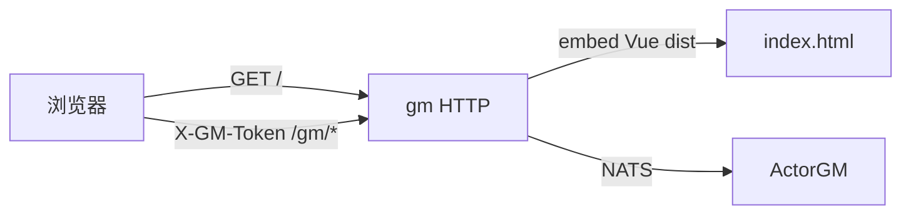

# GM Web 控制台 策划文档

> **Status:** approved  
> **实施计划：** [`2026-09-14-gm-web-ui.md`](2026-09-14-gm-web-ui.md)  
> **依赖：** [`2026-09-14-gm-ops-p0-design.md`](2026-09-14-gm-ops-p0-design.md)（P0 JSON API 已落地）

**For agentic workers:** 填完整文各章节；`Status: approved` 前不得创建实施计划、不得改业务代码。无把握处写「待定」并列入风险。

---

## 背景与目标

P0 已提供 GM HTTP JSON（鉴权、查号、背包、发奖、踢人、热更），运营仍只能 curl。需要一个浏览器里能点的控制台。

**一期目标：** 用 **Vue 3 + Vite** 做单页应用，构建产物由 **GM 进程同源托管**。打开 GM HTTP 根路径即可登录并操作现有 P0 全部接口。不新增玩法 API，不做封号/公告/邮件。

已锁定：独立前端工程（非手写单文件 HTML）；生产由 GM 托管（非独立端口）；覆盖 P0 全能力。

---

## 用户场景

1. **登录：** 浏览器打开 `http://127.0.0.1:9080/`（Docker 为 `19080`）→ 输入 token（及可选操作者名）→ 进入控制台。token 只放在 `sessionStorage`，请求头带 `X-GM-Token` / `X-GM-Operator`。
2. **查人：** 按 nickname 或 uid 查账号；按 playerId / 角色名 / uid 查角色；再按 playerId + bagType 看背包表格。
3. **写操作：** 表单发道具 / 踢人 / 配表热更；提交前确认。健康页展示 `/gm/health`（NATS 是否连通）。401 回到登录页。

---

## 功能范围

### 包含

- 前端工程 `web/gm-console/`：Vue 3 + Vite + Vue Router + 中文界面
- 页面：登录、概览（health）、账号查询、角色查询、背包查询、发放道具、踢下线、配表热更
- 发奖 / 踢人 / 热更：二次确认
- GM 进程 `GET /` 与静态资源；非 `/gm/*` 的前端路由回退到 `index.html`
- `//go:embed` 嵌入构建产物；Dockerfile 增加 Node 构建阶段
- 本地 `npm run dev` 可将 `/gm` 代理到 GM HTTP（仅开发便利，生产仍同源）
- 更新 `scripts/start.ps1` / `cicd.ps1` / `docker-compose` 说明：构建 GM 前先 `npm run build`（Docker 内完成）
- 根 README 增加「打开浏览器使用 GM 控制台」

### 不包含

- 新后端能力（扣道具、封号、公告、调时间、在线列表、邮件等，仍见 [`backlog-gm-ops.md`](backlog-gm-ops.md)）
- 多 GM 账号 / SSO / TLS / 权限树（沿用 P0 共享 token）
- 独立前端端口生产部署、CORS 配置
- 道具名下拉（无道具列表 API；一期手填 `itemId`）
- 深色主题、国际化、E2E 浏览器套件（Playwright 等）
- 把 token 写入 URL 或 localStorage

---

## 协议设计

**不新增业务 RPC。** 浏览器只调现有 P0 HTTP：

| 页面 | 方法 | 路径 | 说明 |
|------|------|------|------|
| 概览 | GET | `/gm/health` | 免 token；用于连通性 |
| 登录校验 | GET | `/gm/account?uid=1` 或任意需鉴权接口 | 401 → 登录失败；也可用 health 之外的轻请求 |
| 账号 | GET | `/gm/account?uid=` 或 `?nickname=` | |
| 角色 | GET | `/gm/player?playerId=` / `?name=` / `?uid=` | |
| 背包 | GET | `/gm/bag?playerId=&bagType=` | |
| 发奖 | POST | `/gm/bag/grant` | JSON body 同 P0 |
| 踢人 | POST | `/gm/player/kick` | `uid` 或 `playerId` 二选一 |
| 热更 | POST | `/gm/config/reload` | `{tableName}` |

登录成功判定：带 token 调 `GET /gm/account?uid=0` 会 400（`40030`）而非 401，即可视为 token 有效，避免依赖某个真实 uid。也可调 `POST /gm/config/reload` 太重，**采用「需鉴权接口返回非 401」**：`GET /gm/player` 无参数 → `400/40030` 表示 token 对，`401/40029` 表示 token 错。

前端路由（history，由 GM fallback 支持）：

| 路径 | 页面 |
|------|------|
| `/login` | 登录 |
| `/` | 概览 health |
| `/account` | 查账号 |
| `/player` | 查角色 |
| `/bag` | 查背包 |
| `/grant` | 发道具 |
| `/kick` | 踢人 |
| `/reload` | 配表热更 |

静态资源：`/assets/*`（Vite 默认）。`/gm/*` **禁止**被 SPA fallback 吃掉。

**业务错误码：** 沿用 `40029`–`40031` 及背包码；前端展示 `code` + `message`。

**前置条件：** GM 进程已启动；token 与 P0 相同（开发默认 `dev-gm-token`）。

---

## 数据与持久化

| 表 / 缓存 | 字段 / Key | 索引 / TTL | 说明 |
|-----------|------------|------------|------|
| 浏览器 `sessionStorage` | `gm_token`、`gm_operator` | 关标签即清 | 不落库 |
| `internal/gmapp/ui/` | Vite `outDir` | — | `go:embed`；不提交 `node_modules` |

**事务：** 无。写操作仍由 P0 game 节点审计表记录。

---

## 业务规则

- **同源：** 页面与 API 同一 host/port，不配 CORS。
- **鉴权：** 除 `/login`、`/gm/health` 外，前端路由守卫要求已登录；API 401 清 token 并跳转登录。
- **操作者：** 登录页可选填写，写入 `X-GM-Operator`（缺省 `anonymous`）。
- **危险操作：** grant / kick / reload 必须确认框，确认文案含目标 id。
- **查询互斥：** 与 P0 相同（账号 uid/nickname 二选一等），前端用单选切换，避免同时提交。
- **构建顺序：** `go build ./cmd/gm` 前需已有 `internal/gmapp/ui` 产物；缺产物时嵌入占位 `index.html`（提示先 `npm run build`），API 仍可用。
- **Docker：** 镜像构建先 `npm ci && npm run build`，再 `go build`，保证容器内控制台可用。

---

## 验收标准

- [x] 浏览器打开 GM 根路径出现登录页；错误 token 无法进入业务页
- [x] 正确 token 可完成：查账号、查角色、查背包、发奖、踢人、热更；结果表格/JSON 可读
- [x] grant/kick/reload 有确认框
- [x] 刷新 `/player` 等前端路由不 404（GM fallback）
- [x] `/gm/health`、`/gm/config/reload` 行为与 P0 一致（JSON，非 HTML）
- [x] `go test ./internal/gmapp/...` 覆盖：`/` 返回 HTML；`/gm/health` 仍 JSON
- [x] `go test ./...` 通过
- [x] Docker smoke 后可用浏览器打开 `http://127.0.0.1:19080/`（或文档说明手动点开）
- [x] 根 README 写明控制台地址与默认 token

---

## 风险与依赖

| 项 | 说明 |
|----|------|
| 依赖 | P0 GM HTTP 已合入当前分支 `feat/gm-ops-p0` |
| 构建 | 开发机 / CI 需 Node.js（建议 20+）；Dockerfile 增加 node 阶段，构建变慢 |
| embed | Vite 清空 `outDir`；占位文件策略要保证无 npm 时 `go test` 仍能编译 |
| 安全 | 仍是共享 token + 明文 HTTP，仅内网；token 在浏览器内存/sessionStorage |
| 道具 | 无道具检索 API，发奖只能填数字 ID |

---

## 实施索引

策划 **approved** 后：

1. 复制 [`_template.md`](_template.md) → `2026-09-14-gm-web-ui.md`
2. 实施 plan 文首 **Design:** 链接本文件
3. 任务清单从本章「协议 / 数据 / 验收」派生，不重复粘贴策划正文
